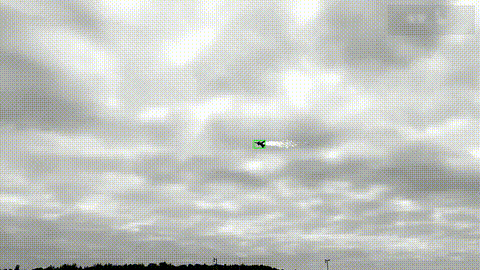

<div align="center">

# :zap: HSpeedTrack (x86)

### High-Speed Visual Object Tracker -- x86 Desktop Port

[](.)
[](.)
[](.)
[](.)
[](.)

*Sub-millisecond per-frame tracking via CPU/GPU pipelining and bitwise descriptor matching.*

</div>

---

## :movie_camera: Demo

<div align="center">



*Tracking a small UAV target across an Anti-UAV thermal sequence at 1920x1080.*
*Green box = predicted target location. Full-resolution video: [`output.mp4`](output.mp4).*

</div>

---

## :information_source: About This Port

The original HSpeedTrack runs on **NVIDIA Jetson Orin Nano Super 8GB (25W edge device)**
at **694 FPS**. This repository is the **x86 desktop port** for development, profiling,
and further optimization on a workstation GPU. Algorithmic improvements made here
(cross-frame CPU/GPU pipelining, bitwise ORB descriptors, stack-allocated buffers)
are intended to be backported to the Jetson target.

---

## :bar_chart: Current Performance (x86 Port)

Measured on **Intel Core Ultra 7 265K + NVIDIA RTX 5070 Ti**, FP16 TensorRT engine,
719-frame Anti-UAV thermal sequence at 1920x1080:

| Metric | Value |
|--------|------:|
| **Average per-frame RUN time (excluding `cv::imread`)** | **0.65 ms** |
| **Effective tracking FPS** | **~1528 FPS** |
| Per-frame `cv::imread` (overlapped with GPU) | ~1.3 ms |
| End-to-end wall-clock per frame (incl. I/O + video write) | ~7.8 ms |
| End-to-end wall-clock for 719 frames | ~5.6 s |

> :warning: This is **not** an apples-to-apples comparison with the 694 FPS Jetson number --
> the RTX 5070 Ti is a 300W desktop GPU vs. the 25W Jetson edge device. The x86 numbers
> exist to validate algorithmic optimizations before backporting to Jetson.

> :bulb: `cv::imread` for frame N+1 is **fully overlapped with frame N's TensorRT inference**
> via double-buffered prefetch, so it does not block the tracking loop.

### :rocket: Key Optimization: Cross-Frame CPU/GPU Pipeline

The main loop double-buffers image reads. While the GPU runs TensorRT inference for
frame N, the CPU concurrently performs `cv::imread` for frame N+1. The buffer is
swapped at the next iteration's start.

```
Frame N CPU work     | Frame N GPU work      | Frame N+1 CPU prep
---------------------|-----------------------|---------------------
GetROI + threshold   |                       |
                     | TRT enqueue (async)   | cv::imread (next img)
cv::erode mask       |   |                   |   |
                     |   v                   |   v
                     | TRT done              | imread done
cudaStreamSync (~0us)|                       |
multiply + topk +... |                       |
```

This eliminates the ~0.45 ms `cudaStreamSynchronize` wait and removes ~1.3 ms of
serial disk I/O per frame -- a combined ~2x reduction in tracking-loop latency
versus the pre-pipeline baseline.

---

## :gear: Pipeline Overview

```
Frame 0 (Initialization)
=========================
Full Image (1920x1080)
   |
   v
Resize to 480x480 --> TRT Inference (Frangi Response)
                           |
                           +--> Prefix-Sum on x_max, y_max
                           |        |
                           |        v
                           |    Shift-Subtract --> Target (x, y, w, h)
                           |                           |
                           v                           v
                     Scale to 1920x1080           Crop 480x480 ROI
                                                       |
                                                       v
                                                  Threshold (Flame Mask)
                                                       |
                                                       v
                                              TRT Inference (ROI Response)
                                                       |
                                                       v
                                                  Parallel Top-K (40 pts)
                                                       |
                                                       v
                                             25x25 Patch --> ORB Descriptors


Frame N (Tracking) -- with cross-frame pipelining
==================================================
Last Target Position
   |
   v
Crop 480x480 ROI from Full Image
   |
   +--> Threshold (Flame Detection + uint8->float Conversion)
   |
   v
TRT Inference -----------------+  (async, GPU stream)
                                |
Erode Flame Mask --------------+  (parallel, CPU)
                                |
cv::imread next frame ---------+  (parallel, CPU disk I/O)
                                |
cudaStreamSynchronize ---------+  (now nearly instant)
   |
   v
Masked Response = Response * Eroded Mask
   |
   +--> Parallel Top-K --> 40 Keypoints
   |
   +--> 25x25 Patches --> Bitwise ORB Descriptors (uint64_t[4])
   |
   +--> Hamming Match (current vs. last frame, popcountll)
   |
   +--> Prefix-Sum + Shift-Subtract --> Candidate Box
   |
   v
Post-Processing (Dual Correction Path)
   |
   +--> ORB Mode-Filtered Correction
   |
   +--> Similar-Triangle Geometric Correction
   |
   v
Final Target Position
```

---

## :trophy: Baseline Comparison

Speed comparison with representative trackers on 1920x1080 Anti-UAV thermal sequences.
Published FPS numbers are from the original papers; HSpeedTrack is measured on RTX 5070 Ti.

| Tracker | Venue | FPS | Hardware | Approach |
|---------|-------|----:|----------|----------|
| **HSpeedTrack (ours, x86)** | -- | **1528** | RTX 5070 Ti (300W) | TensorRT FP16 + CPU/GPU pipeline + bitwise ORB |
| **HSpeedTrack (ours, Jetson)** | -- | **>700** | Jetson Orin Nano Super (25W) | Same algorithm, edge deployment |
| OSTrack-256 [[1]](#ref-ostrack) | ECCV 2022 | ~105 | RTX 2080 Ti | ViT (Vision Transformer) one-stream tracker |
| SiamFC [[2]](#ref-siamfc) | ECCVW 2016 | ~86 | Titan X | Fully-convolutional Siamese network |
| TransT [[3]](#ref-transt) | CVPR 2021 | ~50 | RTX 2080 Ti | Transformer-based feature fusion |
| DiMP-50 [[4]](#ref-dimp) | ICCV 2019 | ~40 | GTX 1080 | Discriminative model prediction |
| SiamRPN++ [[5]](#ref-siamrpn) | CVPR 2019 | ~35 | Titan Xp | Siamese with region proposal |
| ATOM [[6]](#ref-atom) | CVPR 2019 | ~30 | GTX 1080 | Accurate Tracking by Overlap Maximization |
| MixFormer [[7]](#ref-mixformer) | CVPR 2022 | ~25 | RTX 2080 Ti | Mixed attention transformer |

> :information_source: Different hardware makes direct FPS comparison imperfect, but HSpeedTrack's
> **>14x** speed advantage over the fastest baseline (OSTrack) demonstrates the benefit of
> replacing learned feature matching with handcrafted bitwise descriptors + TensorRT-accelerated
> Frangi filtering.

---

## :jigsaw: Key Design Choices

| | Decision | Rationale |
|:-:|----------|-----------|
| :arrows_counterclockwise: | **Cross-frame CPU/GPU pipeline** | `cv::imread(N+1)` runs in parallel with TRT(N); double-buffered |
| :rocket: | TensorRT FP16 inference | Hardware-accelerated Frangi vesselness filter; sub-millisecond latency |
| :abacus: | Prefix-sum + shift-subtract | O(W+H) target localization instead of O(W*H) argmax |
| :thread: | Parallel Top-K (4 threads) | Each thread maintains sorted top-40 over 230,400 elements; merge via `partial_sort` |
| :dna: | **Bitwise ORB descriptors** | `std::array<uint64_t, 4>` + `__builtin_popcountll`; ~32x faster Hamming than naive int array |
| :triangular_ruler: | Similar-triangle correction | Geometric consistency check using 3 matched keypoint pairs |
| :brain: | `cudaMemPrefetchAsync` | Eliminates CUDA Unified Memory page faults on discrete GPUs |
| :dart: | `pthread_setaffinity_np` | Pin to core 0; prevents cache invalidation from OS thread migration |
| :fast_forward: | Branchless threshold | SIMD-vectorizable flame mask generation; `#pragma GCC ivdep` |
| :package: | Stack-allocated `shift_subtract` | `std::array<float, ROI_SIZE>` instead of `std::vector` -- zero per-frame heap alloc |

---

## :open_file_folder: Project Structure

```
hspeedtrack_x86/
  |- hspeedtrack.cc             # Production tracker
  |- hspeedtrack_debug.cc       # Debug version with per-stage timing
  |- build.sh                   # Build script (GCC C++20, OpenMP, TRT, CUDA, OpenCV)
  |
  |- post_process/
  |    |- CtrCorrect.h          # Center-point correction from SmiTri output
  |    |- FilterByBox.h         # Filter keypoints by bounding box proximity
  |    |- FilterKpts.h          # Keypoint filtering by descriptor match quality
  |    |- MatchKptsCorrect.h    # ORB mode-filtered correction
  |    |- SmiTri.h              # Similar-triangle transformation
  |
  |- utils/
  |    |- types.h               # Shared type aliases and constants
  |    |- init_engine.h         # TRT engine loader (deserialize + execution context)
  |    |- parallel_topk.h       # OpenMP parallel Top-K selection (4 threads x 40)
  |    |- descriptor_match.h    # Bitwise ORB descriptor extraction + popcount Hamming
  |    |- get_roi.h             # ROI cropping from full image
  |    |- thresh.h              # Branchless uint8-to-float + flame mask
  |    |- slice.h               # 25x25 patch extraction with bounds clamping
  |    |- box_size.h            # Per-frame target size lookup
  |    |- bit_pattern_21.h      # ORB BRIEF bit pattern (21x21 sampling)
  |    |- utils.h               # Sorted image loading, CUDA check, multiply, shift-subtract
  |    |- omp.h                 # OpenMP shim for clangd LSP
  |
  |- engine_model/              # TRT engine files (platform-specific)
  |- onnx2trt/                  # ONNX models + trtexec conversion
  |- Datasets/                  # Evaluation datasets
```

---

## :package: Prerequisites

> :warning: The following must be installed **before** building or running HSpeedTrack:

| Requirement | Version | Purpose |
|-------------|---------|---------|
| :green_circle: **CUDA** | 12+ | GPU acceleration, unified memory, stream management |
| :green_circle: **TensorRT** | 10+ | Neural network inference (Frangi vesselness filter) |
| :green_circle: **PyTorch** | 2.x | ONNX model export and weight conversion |

Install CUDA and TensorRT via the [NVIDIA CUDA Toolkit](https://developer.nvidia.com/cuda-toolkit)
and [TensorRT](https://developer.nvidia.com/tensorrt). Install PyTorch following the
[official guide](https://pytorch.org/get-started/locally/).

## :package: Dependencies

| Library | Version | Purpose |
|---------|---------|---------|
| :blue_circle: OpenCV | 4.x | Image I/O, resize, morphological erosion, video output |
| :orange_circle: OpenMP | 4.5+ | Parallel Top-K, descriptor extraction, SIMD vectorization |
| :purple_circle: GCC | 12+ | C++20 standard, `constexpr`, `std::string_view`, designated initializers |

---

## :hammer_and_wrench: Build

```bash
# Production build
bash build.sh hspeedtrack.cc hspeedtrack

# Debug build (per-stage timing breakdown)
bash build.sh hspeedtrack_debug.cc hspeedtrack_debug
```

---

## :engine: Generate TensorRT Engine

> :warning: TensorRT engine files are **platform-specific** -- regenerate on each target machine.

```bash
cd onnx2trt

trtexec \
  --onnx=./Norm_Grad_Response_Masked_Max_480.onnx \
  --saveEngine=./Norm_Grad_Response_Masked_Max_480.engine \
  --fp16 \
  --builderOptimizationLevel=5 \
  --tilingOptimizationLevel=3 \
  --avgTiming=16 \
  --useCudaGraph \
  --useManagedMemory \
  --exposeDMA \
  --noDataTransfers \
  --timingCacheFile=./timing.cache \
  --separateProfileRun \
  --dumpProfile
```

Then copy the engine:

```bash
cp onnx2trt/Norm_Grad_Response_Masked_Max_480.engine engine_model/
```

---

## :rocket: Run

```bash
# Place test images in ./Datasets/test_imgs/ (grayscale, 1920x1080, named img_1.jpg, ...)
./hspeedtrack

# Debug mode (prints per-stage timing breakdown including imread overlap)
./hspeedtrack_debug
```

Sample debug output (excerpt):

```
RUN time: 0.91 ms (imread next: 1.90 ms)
  GetROI                : 0.022 ms
  Threshold + flame chk : 0.221 ms
  TRT enqueue + prefetch: 0.108 ms
  Erode mask (CPU||GPU) : 0.285 ms
  CUDA sync             : 0.003 ms     <-- nearly zero thanks to imread overlap
  Multiply resp * mask  : 0.096 ms
  TopK                  : 0.082 ms
  Extract patches       : 0.007 ms
  Extract descriptors   : 0.055 ms
  Match descriptors 1   : 0.008 ms
  Match descriptors 2   : 0.007 ms
  Cumsum + shift sub    : 0.002 ms
  ORB post-process      : 0.004 ms
  SmiTri check          : 0.003 ms
  SmiTri apply + output : 0.011 ms
```

---

## :books: References

- Rublee et al., "ORB: An Efficient Alternative to SIFT or SURF," *ICCV 2011*
- Frangi et al., "Multiscale Vessel Enhancement Filtering," *MICCAI 1998*
- Huang et al., "Anti-UAV410: A Thermal Infrared Benchmark for Tracking Drones in the Wild," *TPAMI 2023*
- <a id="ref-ostrack"></a>[1] Ye et al., "Joint Feature Learning and Relation Modeling for Tracking: A One-Stream Framework," *ECCV 2022*
- <a id="ref-siamfc"></a>[2] Bertinetto et al., "Fully-Convolutional Siamese Networks for Object Tracking," *ECCVW 2016*
- <a id="ref-transt"></a>[3] Chen et al., "Transformer Tracking," *CVPR 2021*
- <a id="ref-dimp"></a>[4] Bhat et al., "Learning Discriminative Model Prediction for Tracking," *ICCV 2019*
- <a id="ref-siamrpn"></a>[5] Li et al., "SiamRPN++: Evolution of Siamese Visual Tracking with Very Deep Networks," *CVPR 2019*
- <a id="ref-atom"></a>[6] Danelljan et al., "ATOM: Accurate Tracking by Overlap Maximization," *CVPR 2019*
- <a id="ref-mixformer"></a>[7] Cui et al., "MixFormer: End-to-End Tracking with Iterative Mixed Attention," *CVPR 2022*
